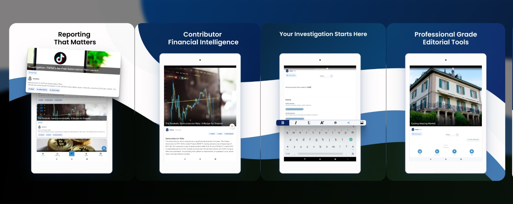

#  ICPress Android

> **Reporting That Matters** — The official Android client for  [ICPress](https://icpress.org)



---

## Overview

[ICPress](https://icpress.org) is an open-source investigative reporting platform delivering in-depth journalism across technology, markets, and beyond. This repository contains the native Android application.

## Self-Hosting

Want to run your own ICPress instance? The full platform and backend services are available as a Docker deployment:

👉 **[ICPress Docker Repository](https://github.com/ICPress/docker)**

> **Note on HTTPS:** When running in **release / production**, the app requires an HTTPS reverse proxy in front of your backend (as described in the Docker configuration). When **building and running in debug mode** via Android Studio, this requirement is temporarily disabled via the Gradle build config — no reverse proxy is needed for local development.

## Connecting to a Custom Endpoint

If you want to release a custom build targeting your own self-hosted endpoint, add your server to the endpoints list in:

📄 [`app/src/main/java/net/crowdventures/storypop/Config.kt`](https://github.com/ICPress/android/blob/main/app/src/main/java/net/crowdventures/storypop/Config.kt)

Add your endpoint and `CDNAccessKey` (must be exactly 16 characters) to the `apiEndpoints` list:

```kotlin
val apiEndpoints = listOf(
    ApiEndpoint("ICPress Global", "https://api.icpress.org", "****************", isDefault = true),
    ApiEndpoint("Custom", "https://your.domain.com", "Your16LengthKey0")
)
```

Replace `https://your.domain.com` with your server's base URL and `Your16LengthKey0` with your custom 16-character CDN token encryption  key.

## Getting Started

### Prerequisites

- Android Studio (latest stable)
- Android SDK

### Build (Debug)

```bash
git clone https://github.com/ICPress/android.git
cd android
./gradlew assembleDebug
```

Open the project in Android Studio and run it on an emulator or physical device. Debug builds connect to any HTTP or HTTPS endpoint without requiring a valid certificate chain.

### Build (Release)

```bash
./gradlew assembleRelease
```

Release builds enforce HTTPS. Ensure your self-hosted backend sits behind a valid TLS reverse proxy before pointing the app at it.

## License

This project is licensed under the [GNU Affero General Public License (AGPL)](LICENSE).
